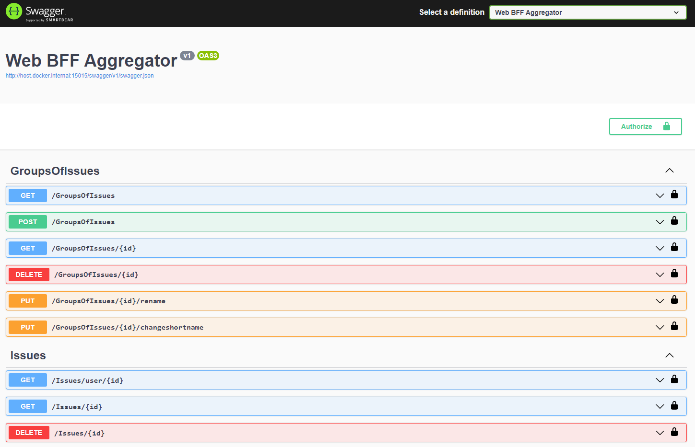

# Project and github docs including readme is in progress state, deadline is: 20.02.2022

# .NET Microservices Simple Application

Simple .NET 6.0 application, based on simplified microservices architecture and Docker containers.

## Swagger of Web BFF

## Getting started

Make sure you have [installed docker](https://docs.docker.com/docker-for-windows/install/)

### Running using Visual Studio

Please follow this instructions: there is link to tutorial

## Architecture overview

There will be image with how architecture is created

## Read futher

- There is link to page explore the application with swagger
- There is link to page explore the code