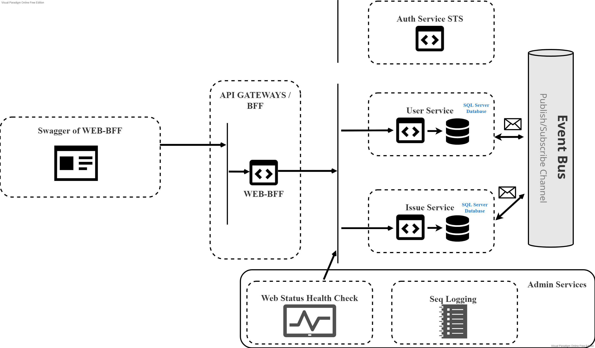

# .NET Microservices Simple Application

**Main purpose of the application is managing issues with their statuses** (like for ex. ToDo, Done). There is a possibility of **creating groups for issues (projects)** and types of groups (for ex. business, development). Each of groups has **Status Flow**, which defines a way, how **status in issue can be changed** (for ex. you can change status from ToDo to Done, but not from Done to ToDo). There is a possibility of **modifying default status flow**, by which new status flows for new groups of issues are created. More about possiblities in: [How to explore application](https://github.com/pavixonpl/projects-on-containers/wiki/Explore-the-application). Application is created for cloud, that's why there is a possibility of existing multiple organizations with own users for each of them, where nothing connects one organization to another.

## Getting started

### Running using Visual Studio

Please follow this instructions: [Running with Visual Studio 2022 on Windows](https://github.com/pavixonpl/projects-on-containers/wiki/Running-with-Visual-Studio-on-Windows)

## Architecture overview

## Read futher

- [Explore the Application](https://github.com/pavixonpl/projects-on-containers/wiki/Explore-the-application)
- [Explore the code](https://github.com/pavixonpl/projects-on-containers/wiki/Explore-the-code)
