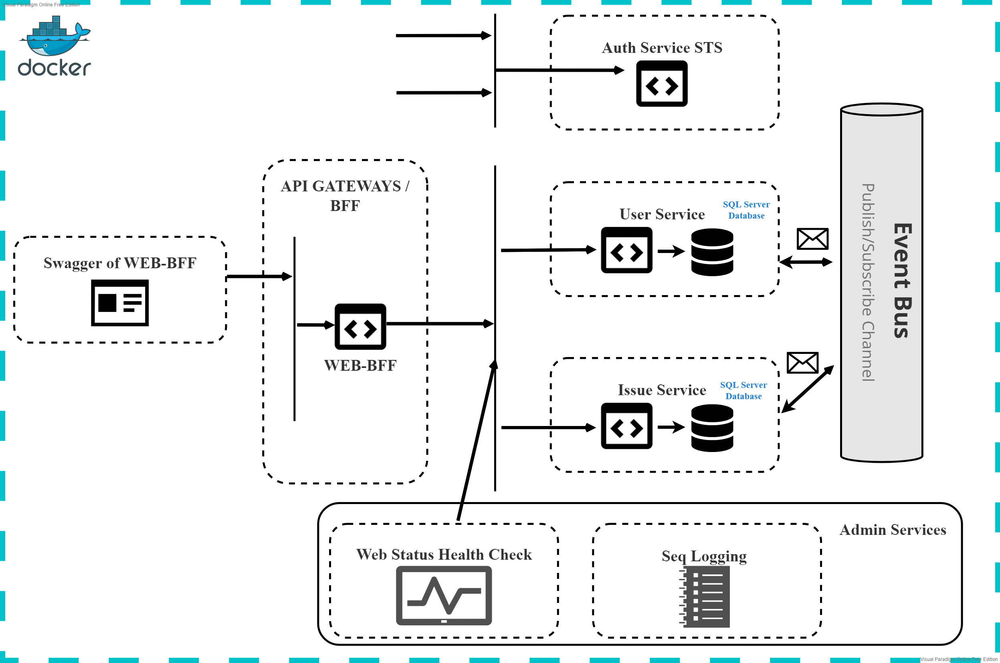

# Project and github docs including readme is in progress state, deadline is: 20.02.2022

# .NET Microservices Simple Application

Simple .NET 6.0 application, based on simplified microservices architecture and Docker containers.

## Swagger of Web BFF

## Getting started

### Running using Visual Studio

Please follow this instructions: [Running with Visual Studio 2022 on Windows](https://github.com/pavixonpl/projects-on-containers/wiki/Running-with-Visual-Studio-on-Windows)

## Architecture overview

## Read futher

- [Explore the Application](https://github.com/pavixonpl/projects-on-containers/wiki/Explore-the-application)
- [Explore the code](https://github.com/pavixonpl/projects-on-containers/wiki/Explore-the-code)
